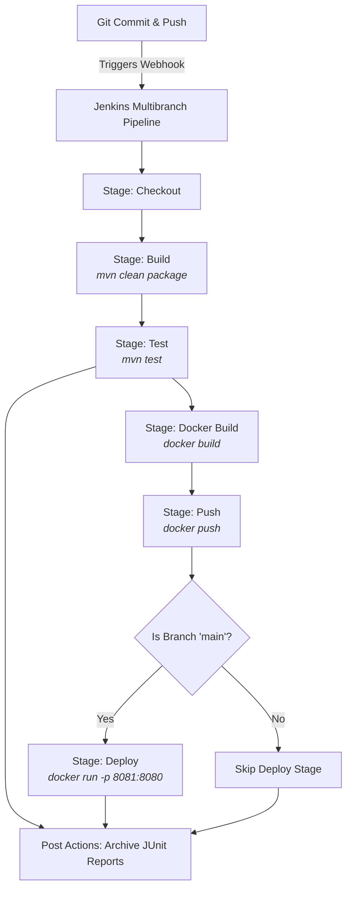

# Java Microservice CI/CD: Jenkins Multibranch Pipeline with Blue Ocean

This repository contains a complete CI/CD pipeline setup for a Java microservice using **Jenkins**, **Blue Ocean**, **Docker**, and **Maven**.

---

## Pipeline Architecture



---

## Project Structure

- `docker-compose.yml`: Local setup file to boot Jenkins with Docker socket sharing.
- `Dockerfile.jenkins`: Custom Jenkins image build script pre-baked with the Docker CLI.
- `pom.xml`: Maven configuration file specifying dependencies for Java compilation and JUnit 5 testing.
- `Dockerfile`: Multi-stage Docker packaging configuration for the Java application.
- `Jenkinsfile`: Declarative Jenkins Pipeline script defining steps, branch-gated actions, and reporting.
- `src/`: Java application code and JUnit test suite.

---

## 🛠️ Step-by-Step Setup Guide

### Step 1: Start Jenkins with Docker Compose

1. Open your terminal in the repository root directory.
2. Run the following command to build the custom image and spin up the Jenkins instance:
   ```bash
   docker-compose up -d
   ```
3. Verify that the Jenkins container is running:
   ```bash
   docker ps
   ```

> [!NOTE]
> Jenkins will be accessible at [http://localhost:8080](http://localhost:8080).
> To grab the initial administrator password, run:
> ```bash
> docker exec jenkins-blueocean cat /var/jenkins_home/secrets/initialAdminPassword
> ```

---

### Step 2: Install Blue Ocean and Required Plugins

1. Complete the initial setup wizard (Unlock Jenkins -> Install suggested plugins -> Create Admin User).
2. Go to **Manage Jenkins** > **Plugins** > **Available Plugins**.
3. Search for and install the following plugins:
   - **Blue Ocean** (installs a suite of Blue Ocean plugins)
   - **Docker Pipeline**
   - **Docker**
   - **Git**
4. Select **Install without restart** or **Download now and install after restart**. Restart Jenkins if prompted.

---

### Step 3: Configure Tools (Maven)

1. Go to **Manage Jenkins** > **Tools** (or **Global Tool Configuration** in older versions).
2. Scroll down to **Maven installations** and click **Add Maven**.
3. Configure the following:
   - **Name**: `maven-3.9` (This must match the tool name defined in the `Jenkinsfile`)
   - **Install automatically**: Checked
   - **Version**: Select `3.9.x` from the dropdown list.
4. Click **Save**.

---

### Step 4: Configure Credentials in Jenkins

1. Navigate to **Manage Jenkins** > **Credentials** > **System** > **Global credentials (unrestricted)**.
2. Click **Add Credentials**:
   - **Kind**: `Username with password`
   - **Scope**: `Global`
   - **Username**: Your Docker Hub / Container Registry username
   - **Password**: Your registry password or Access Token
   - **ID**: `docker-hub-credentials` (Must match the environment ID in the `Jenkinsfile`)
3. Click **Create**.
4. Repeat the process to add your GitHub credentials if your repository is private:
   - **ID**: `github-credentials`
   - **Username**: Your GitHub username
   - **Password**: Your GitHub Personal Access Token (PAT)

---

### Step 5: Configure GitHub Webhook

To automatically trigger builds when changes are pushed:
1. Go to your GitHub repository > **Settings** > **Webhooks** > **Add webhook**.
2. Set the **Payload URL** to:
   ```text
   http://<YOUR_JENKINS_PUBLIC_IP_OR_NGROK_URL>/github-webhook/
   ```
3. Set **Content type** to `application/json`.
4. Trigger on **Just the push event**.
5. Click **Add webhook**.

---

### Step 6: Create the Multibranch Pipeline

1. From the Jenkins dashboard, click **New Item**.
2. Enter a name (e.g., `java-microservice-pipeline`) and select **Multibranch Pipeline**. Click **OK**.
3. Under **Branch Sources**, click **Add source** > **GitHub** (or **Git** if hosting elsewhere).
4. Select the configured credentials and input the repository URL.
5. Under **Build Configuration**, ensure the **Mode** is set to `by Jenkinsfile` and the **Script Path** points to `Jenkinsfile`.
6. Click **Save**.
7. Jenkins will scan the repository and launch builds automatically for any branch containing the `Jenkinsfile` (e.g., `main`, `dev`, `feature/*`).

---

## 🌟 Visual Pipeline (Blue Ocean Dashboard)

To view the visually appealing pipelines:
1. Navigate to the Jenkins Dashboard.
2. Click the **Open Blue Ocean** link on the left-hand navigation panel.
3. Select your pipeline. You will see a modern, node-based interactive graph displaying stages, live logs, test reports, and branch comparisons.

> [!TIP]
> - The **Deploy** stage will run automatically **only** when changes are merged to the `main` branch.
> - The **JUnit test results** tab in Blue Ocean will present graphical trends of passed, skipped, or failed test suites automatically on every run.
